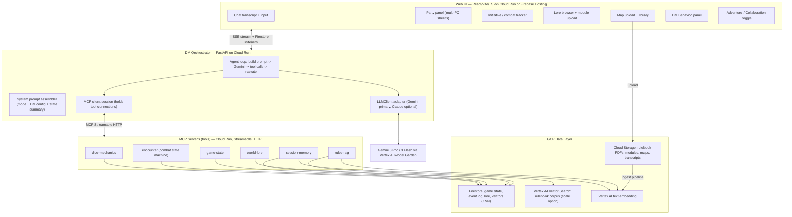

# Agentic Dungeon Master — Build Blueprint

**A solo-player D&D 5e engine where one human runs the whole party and Gemini runs the world.**

Built on Google Cloud Platform, orchestrated with the Model Context Protocol (MCP), developed in VS Code with Claude Code, and shipped from GitHub.

---

## 1. What you're building (in one paragraph)

A web app where you sit down alone, controlling Elira, Janos, JuJu, Rayden and the rest of the party, and an agentic **Gemini 3 Pro** acts as Dungeon Master: it narrates, voices every NPC, runs combat, rolls dice, looks up rules, remembers what happened three sessions ago, and tracks the state of the game. It has two gears — **Adventure Mode** (Gemini actively DMs a live session) and **Collaboration Mode** (you and Gemini build world lore and prep adventures together) — and a settings panel where you declare exactly how the DM should behave at the table.

The architectural spine is **MCP**: every concrete capability the DM needs (roll a d20, look up a grappling rule, apply 8 damage to a goblin, recall what the party did in Woodbank) is a tool exposed by an MCP server. The orchestrator holds an MCP client session to those servers and hands the tools to Gemini, so the model decides *what* to do and the tools decide *what actually happens*.

---

## 2. Why MCP is the backbone

The brain is Gemini. The hands are MCP servers. Keeping them separate buys you three things:

1. **Determinism where it matters.** Dice, HP math, and the combat turn order must be exact and auditable — those live in code (MCP tools), not in the model's head. The model decides *what* to do; the tools decide *what actually happens*.
2. **One tool layer, many consumers.** The same MCP servers serve the deployed orchestrator at runtime, and they can also be attached to Claude Code or Gemini CLI during development so you can exercise tools interactively before the UI exists.
3. **Clean growth.** Adding a capability (a treasure-generator, a random-encounter table, a weather tracker) means adding one MCP tool, not rewiring the agent.

**How Gemini talks to MCP (read this before you build).** The Gemini Gen AI SDKs have built-in MCP support in Python and JavaScript, and the Python SDK auto-executes tool calls and loops until the model finishes. Two current limits shape the design:

- The integration consumes **tools only** — it reads `list_tools` and ignores MCP *resources* and *prompts*.
- **Native remote MCP isn't wired up for Gemini 3 yet** (Google says it's coming). So the orchestrator holds the MCP **client session itself** — which can still connect to your remote Cloud Run servers over Streamable HTTP — and passes that session into the Gen AI SDK.

If you'd rather not lean on an experimental feature, the boring, version-proof alternative is to translate each MCP tool's schema into a Gemini **function declaration** and dispatch the calls in your own loop. Gemini function calling against any Cloud Run endpoint is rock-solid. Either way, your MCP servers are unchanged, and they still use the recommended **Streamable HTTP** transport (FastMCP, `stateless_http=True, json_response=True`) so they scale cleanly on Cloud Run.

(Refs: [Gemini function calling + MCP](https://ai.google.dev/gemini-api/docs/function-calling), [FastMCP ↔ Gemini](https://gofastmcp.com/integrations/gemini), [MCP Python SDK](https://github.com/modelcontextprotocol/python-sdk).)

---

## 3. Architecture at a glance



---

## 4. Tech stack & GCP services map

| Concern | Choice | Why |
|---|---|---|
| DM reasoning model | **Gemini 3 Pro for hard DM turns, Gemini 3 Flash for routine/cheap subtasks, via Vertex AI** | Single-vendor GCP stack; you already know Vertex/Gemini; Pro is cheaper per token than top-tier Claude and Flash is cheap for high-volume narration; the large context window holds lots of lore/rules in-context. Confirm exact model IDs in Model Garden for your region (3.1 Pro is in preview). |
| LLM access | **`LLMClient` adapter** — Gemini implementation primary; Claude-via-Vertex optional behind the same interface | Both models live on Vertex, so a thin interface lets you A/B or swap per turn without marrying the project to one model. |
| Agent orchestration | **FastAPI** on Cloud Run | Async, streams well, holds the MCP client session and the Gen AI SDK function-calling loop. |
| Tool layer | **MCP servers** (FastMCP, Streamable HTTP) on Cloud Run | Deterministic, reusable; the orchestrator connects to them as an MCP client. |
| Game state + event log | **Firestore (Native mode)** | Document model fits character sheets and append-only events; real-time listeners drive the live UI for free. |
| Session-memory recall | **Firestore vector search (KNN)** | Small corpus, co-located with the events it indexes. No extra service to run. |
| Rulebook RAG | **Firestore vectors to start; graduate to Vertex AI Vector Search** | Start cheap/simple; move the big corpus to Vector Search if recall/latency demands it. You've already done ~5k chunks on Vertex, so the path is known. |
| Embeddings | **Vertex AI `text-embedding`** | Same platform; one auth story. |
| Blobs | **Cloud Storage (GCS)** | Rulebook PDFs, uploaded modules, uploaded maps, exported transcripts. |
| Battle maps | **Uploaded by you, stored in GCS, shown in the UI** | Maps are created in your own external workflow (e.g. your Gemini/Imagen prompt-crafting) and uploaded; the app catalogs, displays, and overlays tokens on them. No AI generation in the runtime loop. |
| Secrets | **Secret Manager** (minimal — Vertex uses ADC service-account auth) | Few secrets needed since Vertex auth is keyless. |
| CI/CD | **GitHub + Cloud Build (or GitHub Actions) + Workload Identity Federation** | Keyless GitHub-to-GCP deploys to Cloud Run. |
| Dev environment | **VS Code + Claude Code** (build) and **Gemini CLI** (runtime-faithful playtest) | Claude Code writes the app; Gemini is the runtime model. Both can attach the MCP servers for terminal testing. |

> **Reuse note:** Your existing D&D DM Assistant already has the Vertex RAG ingestion pipeline, NPC/creature generation, and lore CRUD — all on Gemini/Vertex, so they lift over with even less friction now that the runtime model is also Gemini. (Map generation stays in your separate external workflow; the app only stores and displays the results — see Sections 5 and 11.) The new work is the MCP tool wrapping, the agent loop, the two modes, the combat state machine, and the solo multi-character handling.

### The `LLMClient` adapter

Keep the orchestrator model-agnostic with one small interface so you're never married to a single model:

```python
from typing import Protocol

class LLMClient(Protocol):
    def generate(self, system: str, messages: list, tools: list) -> "LLMResult":
        """Returns final narration text and/or a list of tool calls to dispatch."""
```

- **`GeminiClient` (primary)** wraps the Gen AI SDK against Vertex, maps your MCP tools to Gemini function declarations (or passes the MCP client session for auto-calling), and tiers **Pro** vs **Flash** per turn.
- **`ClaudeClient` (optional)** wraps Claude-via-Vertex behind the same interface, for A/B comparison on your real Table Rules.

The agent loop talks only to `LLMClient`, so switching or A/B-testing models is a config change, not a rewrite.

---

## 5. The MCP servers (your tool catalog)

Define these as logical servers. For deployment you can co-locate them into 2–3 Cloud Run services (e.g. one "mechanics" service that is stateless, one "data" service that touches Firestore) — the agent doesn't care how they're grouped.

### `dice-mechanics` (stateless, pure logic)
- `roll(notation)` — e.g. `"2d6+3"`, returns each die + total
- `roll_check(modifier, dc, advantage)` — skill/ability check resolution
- `roll_attack(bonus, target_ac, advantage)` — hit/miss + crit flag
- `roll_save(modifier, dc, advantage)` — saving throw
- `roll_initiative(modifiers)` — returns sorted order

### `encounter` (combat state machine; reads/writes Firestore)
- `start_encounter(combatants[])` — seeds initiative, sets turn cursor
- `get_combat_state()` / `get_turn_order()` — current snapshot
- `next_turn()` / `advance_round()` — move the cursor
- `apply_damage(combatant_id, amount)` / `heal(combatant_id, amount)`
- `apply_condition(combatant_id, condition, duration)` / `remove_condition(...)`
- `set_position(combatant_id, x, y)` — grid coordinates for the map
- `end_encounter()` — closes out, returns a summary for the memory log

### `game-state` (reads/writes Firestore)
- `get_party()` — all PCs (the solo player controls every one)
- `get_character(id)` / `update_character(id, patch)` — HP, conditions, inventory, spell slots, XP
- `get_scene()` / `set_scene(location, description, present_npcs)` — scene state also carries the **active map** reference (which uploaded map is in play); you choose it in the UI, and it is read-only to the AI
- `add_inventory(id, item)` / `spend_resource(id, resource, n)`

### `session-memory` (event log + semantic recall; Firestore + embeddings)
- `log_event(type, summary, details)` — append-only; embed the summary
- `recall(query, k)` — KNN over past event summaries ("what happened with Captain Garrett Rook?")
- `get_recent(n)` — last N events for short-term continuity
- `start_session()` / `end_session(recap)` — session boundaries + an auto-recap

### `rules-rag` (read-only knowledge)
- `search_rules(query, k)` — KNN over the ingested rulebook chunks, returns text + source/page for citation
- `get_statblock(name)` — pulls a monster/NPC stat block if present in the corpus
- `get_reference(name)` — canonical quick references (conditions list, action economy, etc.) as a **tool**. (Gemini's MCP path reads tools but not MCP *resources*, so expose these as tools rather than resources.)

### `world-lore` (CRUD; heavy in Collaboration Mode)
- `create_lore(type, name, body)` / `update_lore(id, patch)` / `delete_lore(id)`
- `get_lore(id)` / `search_lore(query)` — factions, NPCs, places (Gull's Reach, Anchor Bay, Tide's End, Ironshoal, Woodbank), quests, history
- `list_modules()` / `get_module(id)` — uploaded/pre-written adventures available to draw from

> Keep tools **deterministic and side-effecting**. All narration and creative generation happens in the orchestrator's Gemini call, not inside tools — and there are no generative tools at all. Maps are produced outside the app and uploaded; the AI only *reads* which map is active for the current scene (via `get_scene` / `get_combat_state`) so it can reference the layout and keep token positions within the grid. It never creates maps.

---

## 6. The DM behavior declaration

This is the "tell the AI how to behave" requirement. Store a per-campaign config doc in Firestore; the orchestrator compiles it into the system prompt every turn. Surface it as a **"Table Rules"** panel in the UI.

| Field | Example values | Effect |
|---|---|---|
| `tone` | gritty / heroic / comedic / horror | Sets narration voice |
| `rules_strictness` | RAW / balanced / rule-of-cool | How literally to apply mechanics |
| `lethality` | forgiving / standard / deadly | Monster tactics, save-or-die handling |
| `dice_transparency` | open / DM-screen | Whether the AI shows enemy rolls or hides them |
| `narration_length` | terse / medium / cinematic | Words per beat |
| `pacing` | sandbox / guided | How hard to push the plot forward |
| `npc_voice` | distinct accents / plain | NPC dialogue style |
| `content_boundaries` | free-text lines & veils | Hard limits the DM must never cross |
| `combat_detail` | narrative / tactical | How much grid/positioning detail to surface |
| `house_rules` | free-text | E.g. "crits max the first die," flanking on/off |
| `agency` | low / high | How much the AI improvises vs. waits for player input |

Free-text directives at the bottom let you write anything the structured fields don't cover ("Lyra should stay nervous around water until her arc resolves").

---

## 7. The two modes

### Adventure Mode — Gemini DMs the session
- System prompt declares: *one human plays the entire party; you voice all NPCs and monsters; resolve mechanics through tools.*
- The agent loop narrates a scene, then prompts the player to declare actions for each PC.
- In combat: call `start_encounter`, then walk initiative. On a **PC's** turn, ask the player what that character does and resolve with dice tools. On an **NPC/monster** turn, Gemini decides tactics and resolves. Call `next_turn` each time.
- Every meaningful beat → `log_event`. Before acting, `recall` / `get_recent` for continuity.
- The AI may advance the world (passage of time, consequences) within the `pacing`/`agency` settings.

### Collaboration Mode — you and Gemini prep the world
- No autonomous play; Gemini is a worldbuilding co-author and prep assistant.
- Heavy use of `world-lore` CRUD: invent factions, NPCs, locations, plot hooks; refine The Shattered Meridian's canon; keep the campaign bible consistent.
- An **upload area** for adventure suggestions or pre-written modules (PDF/markdown). Uploads go to GCS and through the ingestion pipeline into a separate **`modules`** namespace, so Adventure Mode can later pull from them via `get_module` / `search_rules`.
- Gemini can balance encounters, draft read-aloud text, and stitch your ideas into the existing lore — but it commits nothing to the live game state. (Maps are made externally and uploaded, not generated here.)

The mode is a flag the orchestrator reads. It changes (a) the system prompt, (b) which tools are emphasized, and (c) whether the AI is permitted to mutate live game state and advance the narrative.

---

## 8. The agentic loop (orchestrator core)

Each player message triggers:

1. **Assemble the system prompt:** DM behavior config + active mode instructions + a compact game-state summary (party HP/conditions, current scene, active encounter if any) + the solo multi-character contract.
2. **Inject working memory:** `get_recent(n)` always; `recall(query)` when the message references the past. (With Gemini's large context window you can keep more of this resident in-context and lean less on recall.)
3. **Call Gemini (Vertex)** via the Gen AI SDK function-calling loop, with your MCP tools attached — through the `LLMClient` adapter.
4. **Tool loop:** Gemini requests function calls → the orchestrator dispatches them to the MCP servers (or the SDK auto-calls via the MCP client session) → results return → repeat until Gemini produces final narration. Cap iterations to avoid runaway loops.
5. **Persist:** write any state changes (already done inside the tools), `log_event` the outcome, stream the narration to the UI over SSE.
6. **Turn handoff:** if mid-combat, surface whose turn is next; otherwise prompt for the party's next actions.

Keep the model tier configurable per-turn through the adapter: route routine turns and cheap classification (e.g. "does this message need a memory recall?") to **Gemini 3 Flash**, and hard narrative/encounter-design turns to **Gemini 3 Pro**.

---

## 9. Storage design

**Firestore collections**
- `campaigns/{id}` — DM behavior config, current mode, metadata
- `campaigns/{id}/characters/{pcId}` — sheet, HP, conditions, inventory, resources
- `campaigns/{id}/scene` — current location, description, present NPCs
- `campaigns/{id}/encounters/{encId}` — combatants, initiative, turn cursor, round, grid positions
- `campaigns/{id}/events/{eventId}` — append-only log `{type, summary, details, embedding, ts}`
- `campaigns/{id}/lore/{loreId}` — `{type, name, body, embedding}`
- `campaigns/{id}/maps/{mapId}` — uploaded-map registry: `{name, gcs_path, grid_w, grid_h, scene_tag, is_active}`
- `campaigns/{id}/sessions/{sessionId}` — boundaries + auto-recap

The `embedding` fields enable Firestore KNN for `recall` and `search_lore`. Game state and the event log both back the live UI through real-time listeners, so the party panel and combat tracker update without polling.

**Cloud Storage buckets**
- `rulebooks/` — source PDFs (SRD, supplements)
- `modules/` — uploaded/pre-written adventures
- `maps/` — uploaded battle maps (created in your external workflow)
- `transcripts/` — exported session logs

**Vector index for rules**
- Start with Firestore vectors. If the rulebook corpus grows and recall/latency suffer, move just that corpus to **Vertex AI Vector Search** and keep everything else in Firestore.

---

## 10. RAG ingestion pipeline

1. A file lands in `gs://.../rulebooks/` (or `modules/`).
2. A **Cloud Run job** (or Eventarc-triggered function) extracts text, chunks recursively (~500–1000 tokens, ~15% overlap), and tags each chunk with `{source, book, page, namespace}` where namespace ∈ {`rules`, `modules`}.
3. Embed each chunk with Vertex `text-embedding`.
4. Write vectors + metadata to the index.
5. `rules-rag.search_rules` queries by namespace so Adventure Mode can search rules, modules, or both, and always returns source/page for in-narration citation.

This is the piece you can lift most directly from your existing assistant — it's already Gemini/Vertex-native.

---

## 11. The UI

A React + Vite + TypeScript app (Tailwind) served from Cloud Run or Firebase Hosting.

- **Chat transcript** — streamed narration; dice results and tool actions rendered as inline cards (e.g. "Janos: attack roll 18 → hit, 9 slashing").
- **Input box + quick actions** — free text plus buttons (Roll, Attack, Cast, Help) and a per-PC selector so it's clear which character is acting.
- **Party panel** — a card per PC (HP bar, conditions, key resources, inventory). The solo-player nerve center; click a card to make that PC the active actor.
- **Combat tracker** — initiative list with the turn cursor, round counter, quick damage/condition controls; optional grid/map view fed by `set_position`.
- **Scene/map viewer** — displays the active uploaded map; in combat, overlays tokens on its grid using `set_position` coordinates.
- **Map upload + library** — drag-drop a map image to GCS, tag it (name, grid dimensions, scene), browse your library, and pick which map is active for the current scene/encounter.
- **Lore browser** (Collaboration) — searchable campaign bible with inline editing.
- **Module upload** (Collaboration) — drag-drop into GCS + ingestion.
- **Table Rules panel** — the DM behavior config editor.
- **Mode toggle** — Adventure ↔ Collaboration.
- **Session log / recap** — start/end session, view auto-recaps.

Wire state via Firestore listeners; wire the narration stream via SSE/WebSocket from the orchestrator.

---

## 12. Repo structure (monorepo)

```
agentic-dm/
├── CLAUDE.md                 # project conventions for Claude Code
├── .mcp.json                 # MCP servers attached to Claude Code
├── .gemini/                  # Gemini CLI settings (MCP servers for runtime-faithful playtests)
├── README.md
├── BLUEPRINT.md              # this document
├── infra/                    # Terraform or gcloud scripts (project, Firestore, buckets, Cloud Run, WIF)
├── orchestrator/
│   ├── app/                  # FastAPI agent loop + MCP client + system-prompt assembler
│   └── llm/                  # LLMClient adapter: gemini_client.py (primary), claude_client.py (optional)
├── mcp-servers/
│   ├── mechanics/            # dice-mechanics + encounter
│   ├── data/                 # game-state + session-memory + world-lore
│   └── rules/                # rules-rag
├── ingestion/                # Cloud Run job: chunk + embed + index
├── web/                      # React/Vite/TS UI
└── .github/workflows/        # CI/CD to Cloud Run
```

---

## 13. Step-by-step build order

### Phase 0 — Foundations (½ day)
1. Create a GCP project; enable Vertex AI, Firestore, Cloud Run, Cloud Build, Cloud Storage, Secret Manager, Eventarc.
2. Enable **Gemini 3 Pro and Gemini 3 Flash** in **Vertex AI Model Garden** for your region (optionally enable a Claude model too, for the adapter's A/B path). Note the exact model IDs.
3. Create the GCS buckets and the Firestore database (Native mode).
4. Create a GitHub repo; clone into VS Code. Run `gcloud auth application-default login` so the Gen AI SDK can reach Vertex via ADC.
5. Write a first-pass `CLAUDE.md` (stack, conventions, "all mechanics go through MCP tools; runtime model is Gemini via the LLMClient adapter").

### Phase 1 — First MCP server + terminal loop (1 day)
6. Build `dice-mechanics` with FastMCP (`transport="streamable-http"`, `stateless_http=True`).
7. Add it to `.mcp.json` (Claude Code) and `.gemini/` settings (Gemini CLI), and confirm a model can call `roll` and `roll_attack` from the terminal. **This is your proof that the MCP spine works** before any UI exists — and Gemini CLI gives you a runtime-faithful version of that test.
8. Containerize and deploy it to Cloud Run.

### Phase 2 — State & memory (2–3 days)
9. Define the Firestore schema (Section 9).
10. Build `game-state` (party, characters, scene). Seed it with your real party: Elira, Janos, Lyra Blackwood, JuJu, Rayden.
11. Build `session-memory` with `log_event` + KNN `recall`.
12. Build `encounter` (the combat state machine) on top of `game-state`.
13. Exercise all of it from the terminal: start an encounter, apply damage, recall an event.

### Phase 3 — Knowledge (2–3 days; reuse prior pipeline)
14. Stand up the ingestion job; load the SRD and your rulebooks into the `rules` namespace.
15. Build `rules-rag.search_rules` + `get_reference`, returning text + source/page.
16. Build `world-lore` CRUD; import existing Shattered Meridian lore (Vandross, Dragontooth Mountains, the coastal towns, Woodbank's businesses).

### Phase 4 — The agentic orchestrator (3–5 days)
17. FastAPI service: the `LLMClient` adapter with `GeminiClient` first; an MCP client connected to all servers.
18. Implement the system-prompt assembler: DM config + mode + state summary + solo multi-character contract.
19. Implement the Gen AI SDK function-calling loop with an iteration cap and SSE streaming; tier Pro vs Flash per turn.
20. Implement the **mode switch** and the **combat turn handoff** (PC turn → ask player; NPC turn → AI resolves).
21. Test a full text-only encounter end to end through the orchestrator. (Optional: add `ClaudeClient` and A/B a few scenes.)

### Phase 5 — DM behavior config (½–1 day)
22. Add the `campaigns/{id}` config doc and wire it into the prompt assembler. Test that changing `lethality` or `tone` visibly changes play.

### Phase 6 — UI (4–6 days)
23. Scaffold the React app; build chat + streaming first.
24. Add the party panel and combat tracker wired to Firestore listeners.
25. Add the Table Rules panel, mode toggle, lore browser, and module upload.
26. Add the map upload + library and the scene/map viewer (upload to GCS, register grid dimensions in Firestore, select the active map, overlay tokens on its grid).

### Phase 7 — Ship it (1–2 days)
27. Set up Workload Identity Federation for keyless GitHub → GCP auth.
28. Add `.github/workflows` (or Cloud Build triggers) to build and deploy the orchestrator, MCP servers, ingestion job, and UI to Cloud Run on push to `main`.
29. Lock down IAM (least privilege per service), set Cloud Run min instances to 0 to keep idle cost near zero, and turn on Vertex request logging.

### Phase 8 — Play and refine
30. Run a real Shattered Meridian session solo. Tune the DM config, prompt assembler, and tool surface based on where the AI stumbles.

---

## 14. Dev workflow: who builds vs. who runs

Two distinct roles, easy to conflate:

- **Claude Code builds the app.** It writes the orchestrator, the MCP servers, the UI. `.mcp.json` attaches your project's MCP servers to Claude Code so you can sanity-check tool behavior in the terminal — note this is a *tool-correctness* test driven by Claude, not a mirror of runtime.
- **Gemini runs the game.** For a runtime-faithful terminal playtest, point **Gemini CLI** at the same MCP servers (it speaks MCP too), or just test through your orchestrator once Phase 4 lands.

Other tips:
- **`CLAUDE.md`** should state the hard rules: mechanics only through MCP tools; the model never invents HP totals or dice results; tools are deterministic; narration lives in the orchestrator; the runtime model is Gemini behind the `LLMClient` adapter.
- Build the MCP servers **before** the orchestrator and the orchestrator **before** the UI. Each layer is testable from the terminal without the layer above it, so you're never blocked waiting on the front end.
- Keep the model tier configurable per-turn so you can dial cost vs. quality as you playtest — and keep the `ClaudeClient` stub around so an A/B is a one-line switch.

---

## 15. Cost & ops notes

- Cloud Run min-instances = 0 means you pay essentially nothing when not playing.
- Most spend is **Gemini tokens** during live sessions. Gemini 3 Pro is cheaper per token than top-tier Claude, and routing routine/classification turns to **Gemini 3 Flash** cuts the bill further. Use **Vertex context caching** on the static parts of your system prompt (DM config, rules excerpts) to avoid re-paying for them every turn.
- Gemini's large context window is a real lever: keep more lore, rules, and session history resident in-context and lean less on RAG/recall round-trips.
- Firestore + small vector indexes for a single-player app stay in the free/near-free tier.
- Embeddings are a one-time-ish cost at ingestion, not per session.

---

## 16. Reference links

- Gemini function calling + MCP: https://ai.google.dev/gemini-api/docs/function-calling
- Google Gen AI SDK (Python): https://googleapis.github.io/python-genai/
- FastMCP ↔ Gemini integration: https://gofastmcp.com/integrations/gemini
- Gemini on Vertex AI: https://cloud.google.com/vertex-ai/generative-ai/docs/learn/models
- Vertex context caching: https://cloud.google.com/vertex-ai/generative-ai/docs/context-cache/context-cache-overview
- MCP Python SDK: https://github.com/modelcontextprotocol/python-sdk
- MCP spec: https://modelcontextprotocol.io
- Firestore vector search: https://cloud.google.com/firestore/docs/vector-search
- Vertex AI Vector Search: https://cloud.google.com/vertex-ai/docs/vector-search/overview
- Claude on Vertex AI (optional adapter path): https://docs.claude.com/en/api/claude-on-vertex-ai

---

*Build order one-liner: dice server → state/memory/encounter → RAG + lore → orchestrator (Gemini via LLMClient) + modes → DM config → UI → CI/CD → play.*
